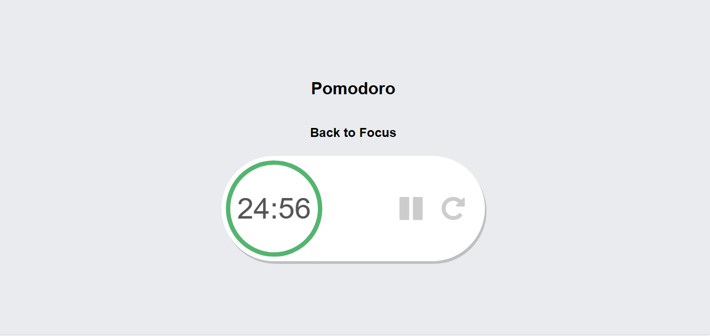

# Pomodoro-Timer-React
Pomodoro Timer using react

The aim of this app is to help you focus on any task you are working on, such as study, writing, or coding. This app is inspired by Pomodoro Technique which is a time management method developed by Francesco Cirillo.
The Pomodoro Technique is created by Francesco Cirillo for a more productive way to work and study. The technique uses a timer to break down work into intervals, traditionally 25 minutes in length, separated by short breaks. Each interval is known as a pomodoro.

Screenshot 1

ScreenShot 2

ScreenShot 3

